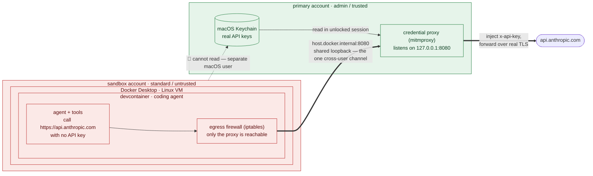

# Developing in a Sandboxed Mac User

```mermaid
flowchart LR
    subgraph SB["sandbox account · standard / untrusted"]
      direction TB
      subgraph VM["Docker Desktop · Linux VM"]
        direction TB
        subgraph DC["devcontainer · coding agent"]
          direction TB
          APP["agent + tools<br/>call https://api.anthropic.com<br/>with no API key"]
          FW["egress firewall (iptables)<br/>only the proxy is reachable"]
          APP --> FW
        end
      end
    end

    subgraph PR["primary account · admin / trusted"]
      direction TB
      PX["credential proxy (mitmproxy)<br/>listens on 127.0.0.1:8080"]
      KC[("macOS Keychain<br/>real API keys")]
      KC -->|"read in unlocked session"| PX
    end

    NET(["api.anthropic.com"])

    FW ==>|"host.docker.internal:8080<br/>shared loopback — the one cross-user channel"| PX
    PX ==>|"inject x-api-key,<br/>forward over real TLS"| NET
    SB -.->|"🚫 cannot read — separate macOS user"| KC

    classDef trusted fill:#e6f4ea,stroke:#137333,color:#0b3d1f;
    classDef untrusted fill:#fbe9e7,stroke:#b71c1c,color:#5c0b0b;
    class PR,PX,KC trusted
    class SB,VM,DC,APP,FW untrusted
```
